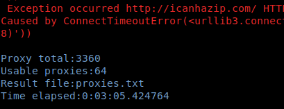

# get_proxies
A simple script used to get proxies from web

## __run.py__ under directory `archived`

To run web scrapers, you might need to go through the CGFW, so the script might need to use proxies as well.

```python
SPIDER_PROXIES = {
    'http': 'socks5://127.0.0.1:1086',
    'https': 'socks5://127.0.0.1:1086'
}
```

### Usage
Install dependencies,
```bash
pip3 install requests
```

Execute the script,
```bash
python3 run.py

python3 run.py -f 'input.txt' -u 'https://www.showmyip.com/' -o 'output.txt
```

Note: the output will overwrite the existing file.

### Preview


## LICENSE

WTFPL